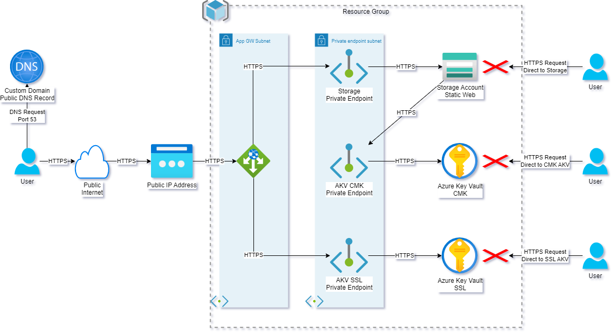

# Architecture

- User accesses site using a custom domain name
- DNS resolves to an Azure Public IP address
- Application Gateway (AppGW) answers the request
  - AppGW retrieves its SSL certificate from Azure Key Vault (AKV)
  - AppGW uses a **user-assigned identity** to authenticate to AKV
  - AppGW communicates to AKV over an HTTP-secured Private Endpoint connection
- AppGW securely forwards the request to the Storage Account (SA)
  - AppGW communicates to SA over an HTTP-secured Private Endpoint connection
- SA responds to AppGW and serves the requested item to the AppGW
  - SA has Static Website enabled
  - SA serves content from special `$web` container
  - Storage account security considerations
    - Secure transfer is set to `required`
    - Anonymous blob access is set to `disabled`
    - Minimum TLS version is set to `1.2`
    - Performance is set to `premium`
    - Kind is set to `BlockBlobStorage`
    - Public network access is set to `disabled`



# Considerations for this approach

## Error seen when setting storage account to Premium tier

It seems that Static Webhosting is only available for StorageV2 accounts in the `Standard` performance tier. When testing a `Premium` performance tier `StorageV2` storage account, the option to enable static web hosting is not enabled. If you attempt to enable via Terraform, it results in the below error. 


```
Error: updating `static_website`: accounts.Client#SetServiceProperties: 
Failure responding to request: StatusCode=400 -- 
Original Error: autorest/azure: Service returned an error. Status=400 
Code="InvalidXmlDocument" Message="XML specified is not syntactically valid.
```

The resolution is to set the account kind to `BlockBlobStorage`. This will enable you to have `premium` level performance and static web hosting. 

## Impact of setting the access level on the web container

Note that while the storage account does explicitly prohibit anonymous blob access, the use of the static web hosting feature does enable anonymous access via the `web` endpoint to the `$web` container. This behavior is identical to that of any un-authenticated web server. 

This has no effect on a storage containers `blob` endpoints. Those endpoints will continue to prohibit anonymous access to blob data. 

You can modify the anonymous access level of the `$web` container, but making this modification has no impact on the primary static `web` endpoint because these files are served through anonymous access requests. That means public (read-only) access to all files.

Disabling anonymous access on a storage account by using the anonymous access setting of the storage account doesn't affect static websites that are hosted in that storage account.
